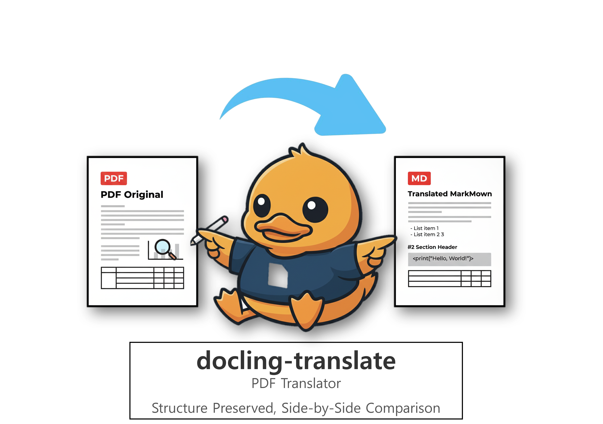

# docling-translate

<p align="center">
  
</p>

[Read in English](docs/README.en.md)

**기술 PDF, 이제 원문과 번역문을 한 문장씩 비교하며 완벽하게 이해하세요.**

[](https://opensource.org/licenses/Apache-2.0)

`docling-translate`는 비영어권 학생, 엔지니어, 연구원들이 기술 PDF 문서를 손쉽게 읽고 이해할 수 있도록 돕는 빠르고 직관적인 오픈소스 번역 도구입니다.

---

## 🤔 왜 `docling-translate`를 사용해야 할까요?

기술 문서를 번역할 때 이런 어려움, 없으셨나요?

*   📄 PDF 내용을 복사하면 서식이 깨져 번역기에 붙여넣기조차 힘들어요.
*   😵 기존 번역기는 문맥 없는 어색한 결과물만 보여줘서 신뢰하기 어려워요.
*   📑 원문과 번역문을 번갈아 보느라 시간을 낭비하고, 흐름을 놓치기 일쑤예요.

`docling-translate`는 **`docling` 라이브러리**의 강력한 문서 분석 능력과 **문장 단위 병렬 보기**를 결합하여 이 모든 문제를 해결합니다.

## ✨ 핵심 기능

| 기능 | 설명 |
| :--- | :--- |
| **📖 문장 단위 원문-번역 대조** | 원문과 번역문을 한 문장씩 나란히 비교하며, 기술 용어의 미묘한 뉘앙스까지 정확하게 파악할 수 있습니다. |
| **🏗️ 완벽한 PDF 구조 분석** | `docling` 라이브러리를 통해 다단, 표, 이미지 등 복잡한 레이아웃을 정확하게 해석하고 원본 구조를 최대한 유지합니다. |
| **📄 3가지 유연한 출력** | 원문(`_en.md`), 번역문(`_ko.md`), 그리고 원문과 번역문이 병기된 통합본(`_combined.md`)을 모두 생성하여 필요에 맞게 활용할 수 있습니다. |
| **🏷️ 빠른 원문 참조** | 모든 텍스트 블록 옆에 원본 PDF의 페이지 번호 `(p. N)`를 표시하여, 원문을 빠르게 찾아볼 수 있습니다. |

## 🚀 빠른 시작

### 1. 의존성 설치

```bash
pip install -r requirements.txt
```

### 2. 사용법

예를 들어, 프로젝트에 포함된 샘플 파일(`Attention Is All You Need` 논문)을 기본 설정(영어->한국어)으로 번역하려면 다음 명령어를 실행하세요.
```bash
python main.py "samples/1706.03762v7.pdf"
```

**언어 지정 (선택 사항):**

다른 언어로 번역하고 싶다면 `-f` (`--from`) 옵션으로 원본 언어를, `-t` (`--to`) 옵션으로 목표 언어를 지정할 수 있습니다.

```bash
# 영문 PDF를 독일어로 번역
python main.py "samples/1706.03762v7.pdf" -f en -t de
```

### 3. 웹 뷰어 실행 (Web Viewer)

편리한 웹 인터페이스를 통해 PDF를 업로드하고 번역할 수 있습니다.

```bash
streamlit run app.py
```

### 🎨 출력 예시

번역 결과물(`_combined.md`)은 아래와 같이 원문과 번역문이 한 문장 단위로 생성되어, 비교하며 읽기 매우 편리합니다.

---
**Original (English)** (p. 1)
> This assignment marks the foundation of your project journey, so please complete it thoroughly and thoughtfully.

**Translated (Korean)** (p. 1)
> 이 과제는 프로젝트 여정의 기초를 마련하는 것이므로 철저하고 신중하게 완료하십시오.
***
**Original (English)** (p. 1)
> List at least 3–5 planned features and system requirements.

**Translated (Korean)** (p. 1)
> 최소 3~5개의 계획된 기능과 시스템 요구사항을 나열하십시오.
---

## 🗺️ 개발 로드맵

- [x] **PDF → Markdown 변환**: `docling`을 사용한 정확한 구조 분석
- [x] **3가지 포맷 출력**: 원문/번역문/통합본 마크다운 파일 생성
- [x] **페이지 번호 표시**: `(p. N)` 형식으로 원본 페이지 번호 참조
- [x] **문장 단위 번역 및 대조**: 가독성 높은 비교를 위한 문장 단위 번역 (완료!)
- [ ] **폴더 단위 번역**: 단일 파일이 아닌 폴더 전체의 PDF를 한 번에 번역하는 기능
- [ ] **성능 향상을 위한 병렬 처리**: 멀티프로세싱을 활용한 대용량 문서 번역 속도 개선
- [ ] **다중 번역 엔진 지원**: GPT API, 로컬 LLM 등 최신 번역 엔진 선택 기능
- [x] **다국어 번역 지원**: 한국어 외 다른 언어로의 번역 기능 확장

## 📚 개발 참고 자료

이 프로젝트는 `docling` 라이브러리를 핵심으로 사용합니다. `docling`의 기능과 사용법을 이해하려면 공식 문서를 참고하는 것이 가장 좋습니다.

*   **`docling` 공식 문서 사이트:** [https://docling-project.github.io/docling/](https://docling-project.github.io/docling/)
*   **`docling` 예제 코드 (GitHub):** [https://github.com/docling-project/docling/tree/main/docs/examples](https://github.com/docling-project/docling/tree/main/docs/examples)

## 🤝 기여하기 (Contributing)

이 프로젝트는 여러분의 기여를 언제나 환영합니다. 버그 수정, 기능 추가, 문서 개선 등 어떤 형태의 기여든 좋습니다.

자세한 개발 워크플로우와 기여 방법은 [**기여 가이드라인 (CONTRIBUTING.md)**](docs/CONTRIBUTING.md) 문서를 참고해주세요.

또한, 건강하고 존중받는 커뮤니티를 위해 [**행동 강령 (CODE_OF_CONDUCT.md)**](docs/CODE_OF_CONDUCT.md)을 준수해 주시기 바랍니다.

## 📜 라이선스

이 프로젝트는 **Apache License 2.0** 라이선스를 따릅니다. 자세한 내용은 `LICENSE` 파일을 참고하세요.