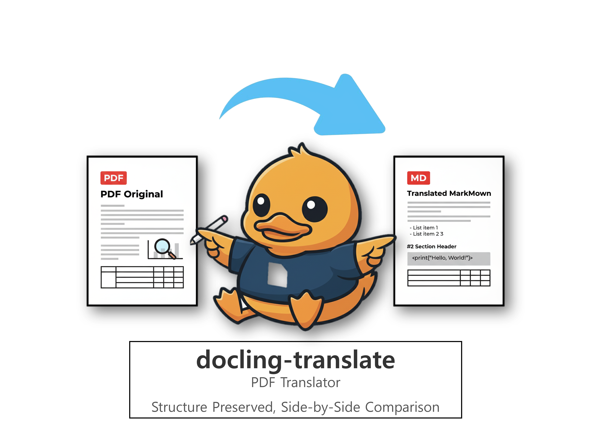

# docling-translate

<p align="center">
  
</p>

> **Structure-Preserving Parallel Translation Tool for Technical Documents**  
> Translate PDF, Word, PPT, and more sentence-by-sentence without breaking the format.

[](../LICENSE)
[](../requirements.txt)

## Overview

`docling-translate` is an open-source tool that leverages IBM's [docling](https://github.com/ds4sd/docling) library to analyze complex document structures (tables, images, multi-column layouts) and provide a **sentence-level 1:1 mapping** between the source and translated text.

Designed to overcome the **imperfections and context loss** often encountered in machine translation. It goes beyond simple text replacement by providing **Side-by-Side** and **Interactive (Click-to-Reveal)** views, allowing users to instantly check the original text and ensure accurate understanding.

## Key Features

- **Multi-Format Support**: Converts and translates `PDF`, `DOCX`, `PPTX`, and `HTML` formats into Markdown.
- **Sentence-Level Parallel Translation**: Precisely matches one source sentence to one translated sentence for maximum readability.
- **Layout Preservation**: Maintains tables and images within the document during translation.
- **Flexible Engine Selection**: Supports Google Translate (Free), DeepL (High Quality), and Gemini (Context Aware).
- **High Performance**: Fast parallel processing for large volumes of documents using multi-threading (`max_workers`).

## Quick Start

### 1. Installation

Requires Python 3.10 or higher.

```bash
git clone https://github.com/gyunggyung/docling-translate.git
cd docling-translate
pip install -r requirements.txt
```

### 2. CLI Usage

This is the most basic usage. Specify a PDF file to generate a translated Markdown file.

```bash
# Basic translation (English -> Korean)
python main.py sample.pdf

# With options (Use DeepL engine, translate to Japanese)
python main.py sample.pdf --engine deepl --to ja
```

### 3. Web UI Usage

Use the intuitive web interface to upload files and visually verify results.

```bash
streamlit run app.py
```

## Detailed Guide

For more detailed usage and configuration instructions, please refer to the documents below.

- [📖 **Detailed Usage Guide (USAGE.md)**](USAGE.md): Full CLI options, API key setup, format specifics.
- [🛠 **Contributing Guide (CONTRIBUTING.md)**](CONTRIBUTING.md): Project structure, development workflow, testing methods.

## License

This project follows the [Apache License 2.0](../LICENSE).